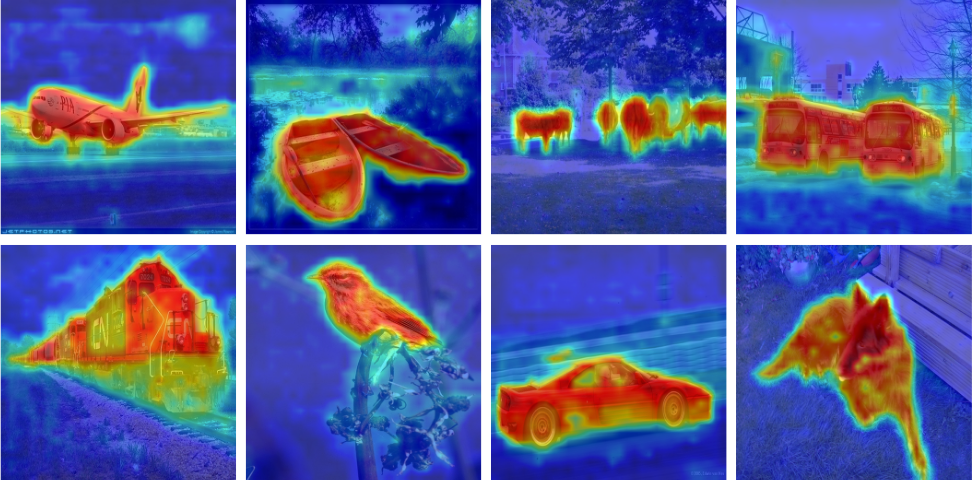

# TransCAM

This is the official repo of the paper: [TransCAM: Transformer Attention-based CAM Refinement for Weakly Supervised Semantic Segmentation](https://arxiv.org/abs/2203.07239)

Accepted to Journal of Visual Communication and Image Representation 2023



## Prerequisite

#### 1. install dependencies 
```pip install -r requirements.txt```

#### 2. Download pretrained model
Download Conformer-S pretrained weights from https://github.com/pengzhiliang/Conformer

Download ResNet-38 pretained weights from https://github.com/YudeWang/SEAM

## Usage

### TransCAM step

#### 1. train the conformer classifier
```python train_TransCAM.py --weights {pretrained_conformer_weights}```

You can also download our trained weights [here](https://drive.google.com/file/d/1-vnpvqtSG4WaLiR9uqLKrBU8wDeIjvqO/view?usp=sharing)

#### 2. TransCAM inference
```python infer_TransCAM.py --weights {trained_weights}```

We provide a notebook for visualizing TransCAM result: [visualize.ipynb](visualize.ipynb)

#### 3. TransCAM evaluation
```python evaluation.py --comment transcam --predict_dir data/transcam/out_cam```

### PSA step

#### 1. train AffinityNet
```python train_aff.py```

#### 2. RW propagation
```python infer_aff.py```

#### 3. RW evaluation
```python evaluation.py --comment transcam_rw --predict_dir data/transcam/out_rw --type png```

### DeepLab step

#### 1. train DeepLab
```python train_deeplab.py```

#### 2. test DeepLab
```python test_deeplab.py```

## Citation
```
@article{li2023transcam,
  title={Transcam: Transformer attention-based cam refinement for weakly supervised semantic segmentation},
  author={Li, Ruiwen and Mai, Zheda and Zhang, Zhibo and Jang, Jongseong and Sanner, Scott},
  journal={Journal of Visual Communication and Image Representation},
  pages={103800},
  year={2023},
  publisher={Elsevier}
}
```

## Acknowledge 
This repo is developed based on SEAM [1] and Conformer [2]

[1] Wang, Yude, et al. "Self-supervised equivariant attention mechanism for weakly supervised semantic segmentation." Proceedings of the IEEE/CVF Conference on Computer Vision and Pattern Recognition. 2020.

[2] Peng, Zhiliang, et al. "Conformer: Local features coupling global representations for visual recognition." Proceedings of the IEEE/CVF International Conference on Computer Vision. 2021.


